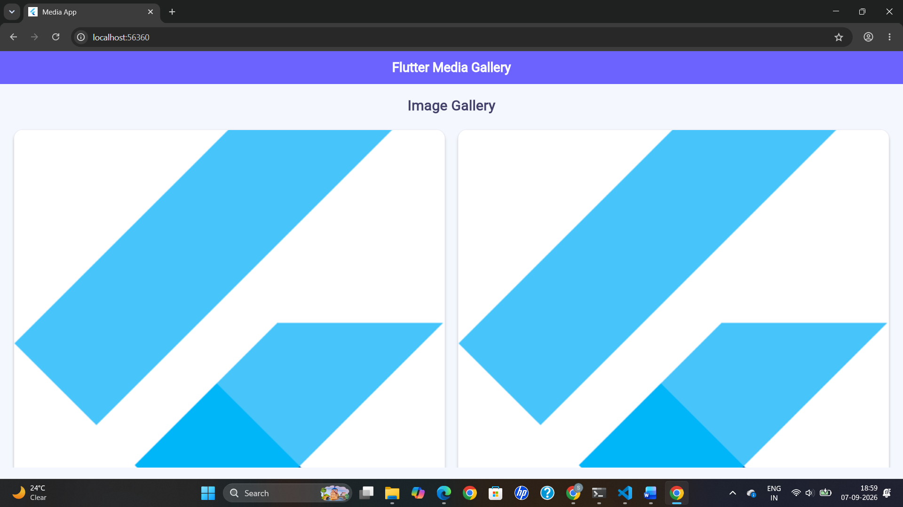

# Experiment 4 – Utilize the Assets and Media

## Aim

To add and display image, audio and video assets in a Flutter application.

## Description

This experiment demonstrates how to use assets and media in Flutter. Images are stored in an asset directory and displayed using the `Image.asset()` widget. `GridView` is used to create an image gallery.

## Technologies Used

- Flutter
- Dart
- VS Code
- GitHub

## Output

